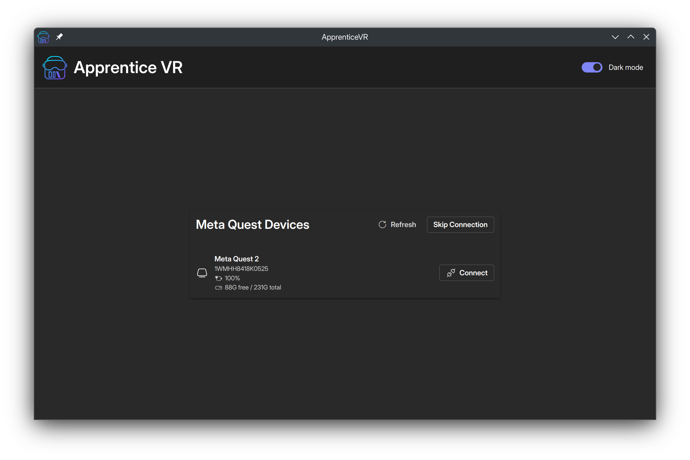
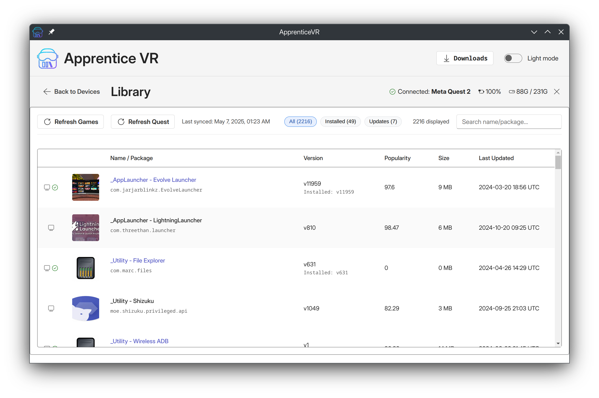
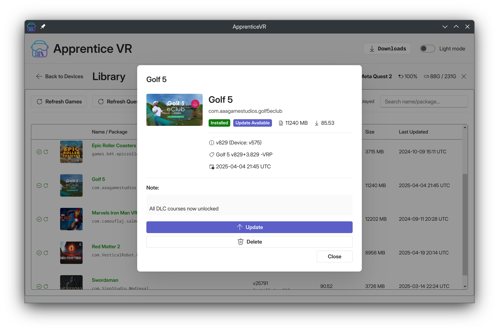
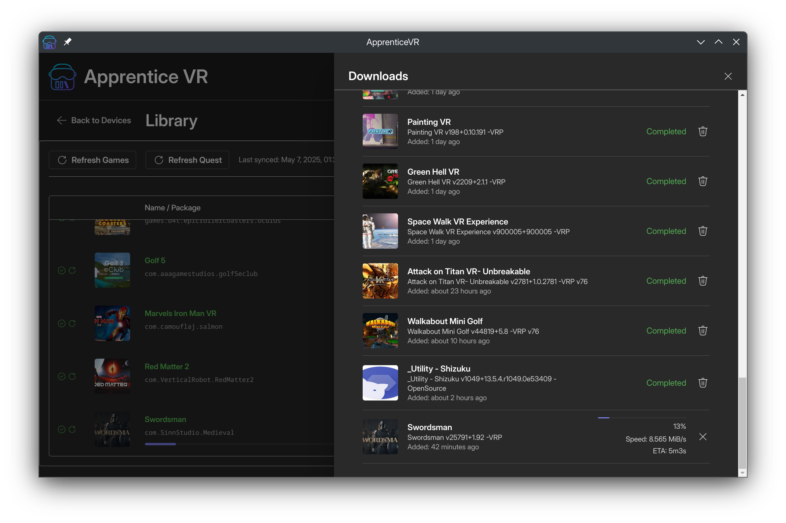

# MythicQuestVR

MythicQuestVR is a modern, cross-platform desktop application built with Electron, React, and TypeScript, designed for managing and sideloading content onto Meta Quest devices. It aims to provide a user-friendly and feature-rich alternative to existing sideloading tools.

## Inspiration

This project is heavily inspired by the fantastic work done on [Rookie Sideloader](https://github.com/VRPirates/rookie) and fork of abandoned [ApprenticeVR](https://github.com/jimzrt/apprenticevr). MythicQuestVR seeks to build upon that foundation by offering a contemporary interface and experience across Windows, macOS, and Linux.

## Features

*   **Cross-Platform:** Works seamlessly on Windows, macOS, and Linux.
*   **Modern User Interface:** Built with Fluent UI and React for a clean and responsive experience.
*   **Device Management:**
    *   Automatically detect and list connected Meta Quest devices.
    *   Connect to and disconnect from devices.
    *   View device details such as model, ID, battery level, and storage information.
    *   Handles unauthorized and offline device states.
*   **Game Library Management:**
    *   Browse a comprehensive list of available games and applications.
    *   View game details including thumbnails, descriptions, versions, popularity, size, and last update date.
    *   Search and filter games by name, package ID, installation status, or available updates.
*   **Installation & Sideloading:**
    *   Download game files and OBBs.
    *   Install, uninstall, and update applications on your Quest device.
    *   Reinstall existing applications.
    *   Handle updates for installed applications.
*   **Download Management:**
    *   View and manage a queue of ongoing and completed downloads.
    *   Track download progress, extraction progress, and installation status.
    *   Cancel, retry, and delete downloaded files.
*   **Automatic Dependency Handling:** Manages required tools like ADB and rclone.
*   **Light & Dark Mode:** Adapts to your system's preferred theme.

## Screenshots

Here are some glimpses of ApprenticeVR / MythicQuestVR in action:

**Device List (Dark Mode)**


**Game Library (Light Mode)**


**Game Details (Light Mode)**


**Downloads Manager (Dark Mode)**


### macOS Specifics

**Important:** Since the application is not signed by an Apple Developer ID, when you first try to open `mythicquestvr.app` on macOS after building or downloading it, you might encounter an error message stating: `"mythicquestvr is damaged and can't be opened. You should move it to the Trash."`

This error occurs because macOS Gatekeeper flags applications downloaded from the internet or built by unidentified developers as potentially unsafe. The `com.apple.quarantine` extended attribute is added to the application bundle by the system.

To resolve this, you can remove this extended attribute by running the following command in your Terminal:

```bash
xattr -c /Applications/mythicquestvr.app
```

**Note:**
*   You might need to adjust the path `/Applications/mythicquestvr.app` if you have placed the application in a different location.
*   The `-c` flag in the `xattr` command stands for "clear," and it removes all extended attributes from the specified file or application bundle. By removing the quarantine attribute, you are essentially telling macOS that you trust this application.

After running this command, you should be able to open MythicQuestVR without any issues.

## Logs

By default, it writes logs to the following locations:

 - **on Linux:** `~/.config/mythicquestvr/logs/main.log`
 - **on macOS:** `~/Library/Logs/mythicquestvr/main.log`
 - **on Windows:** `%USERPROFILE%\AppData\Roaming\mythicquestvr\logs\main.log`

**Note:** When opening an issue, please include the latest log output from the appropriate log file above to help with debugging and troubleshooting.

You can also upload the current log file in the settings menu and share the url.

# Troubleshooting Guide

If MythicQuestVR is unable to connect, follow the steps below to identify and resolve the issue:

---

## ✅ Use the Latest Version

Make sure you're using the latest version of MythicQuestVR:  
➡️ [https://github.com/slax81/mythicquestvr](https://github.com/slax81/mythicquestvr)

---

## 🌐 Check Network Access

Ensure you can access the following URLs from your browser:

- [https://raw.githubusercontent.com/](https://raw.githubusercontent.com/)  
  (Should redirect to the GitHub homepage)

- [https://downloads.rclone.org/](https://downloads.rclone.org/)

- [https://vrpirates.wiki/](https://vrpirates.wiki/)

- [https://there-is-a.vrpmonkey.help/](https://there-is-a.vrpmonkey.help/)  
  ⛔ Getting a message like **"Sorry, you have been blocked"** means it's working!

---

## 🌍 Change DNS Settings

Some ISPs block specific domains. Switch to a public, non-censoring DNS provider:

- [Cloudflare DNS (1.1.1.1)](https://developers.cloudflare.com/1.1.1.1/setup/windows/)
- [Google Public DNS (8.8.8.8)](https://developers.google.com/speed/public-dns/docs/using)
- [OpenDNS](https://www.opendns.com/setupguide/)

---

## 🔐 Try a VPN

If DNS changes don't help, your ISP might be blocking access. Use a VPN to bypass restrictions:

- [ProtonVPN (free)](https://protonvpn.com/)
- [1.1.1.1 VPN (free)](https://one.one.one.one/)
- [Alternate VPN Example](https://gprivate.com/5yxo8)

---

## 🛡️ Router or Firewall Blocking?

If a VPN works, but a direct connection doesn't, your router or antivirus/firewall may be blocking access.  
Check out this guide for help:

➡️ [https://rentry.co/ASUSRouterBlock](https://rentry.co/ASUSRouterBlock)

You can either:

- Continue using a VPN  
- OR identify and whitelist the following domains in your router/firewall settings:
  - `raw.githubusercontent.com`
  - `downloads.rclone.org`
  - `vrpirates.wiki`
  - `there-is-a.vrpmonkey.help`

---

If you're still stuck, feel free to open an issue or ask for help in the community. Happy VR-ing!


## Recommended IDE Setup

- [VSCode](https://code.visualstudio.com/) + [ESLint](https://marketplace.visualstudio.com/items?itemName=dbaeumer.vscode-eslint) + [Prettier](https://marketplace.visualstudio.com/items?itemName=esbenp.prettier-vscode)

## Project Setup

### Prerequisites

*   [Node.js](https://nodejs.org/) (which includes npm)
*   [pnpm](https://pnpm.io/installation) (Recommended package manager)

### Install Dependencies

```bash
pnpm install
```

## Development

To run the application in development mode with hot-reloading:

```bash
pnpm dev
```

This will start the Electron application and open a development server for the React frontend.

## Building the Application

You can build the application for different platforms using the following commands:

```bash
# For Windows
pnpm build:win

# For macOS
pnpm build:mac

# For Linux
pnpm build:linux
```

Builds will be located in the `dist` or a platform-specific output directory.

## Linting and Formatting

To lint the codebase:
```bash
pnpm lint
```

To format the codebase with Prettier:
```bash
pnpm format
```

To perform type checking:
```bash
pnpm typecheck
```


---

